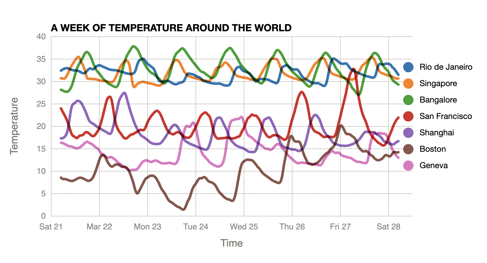

# Line Chart with multiple lines
## A Week Temperature in San Francisco
Follow the video tutorial on FreeCodeCamp.org made by Curran Kelleher: https://www.youtube.com/watch?v=_8V5o2UHG0E&list=WL&index=1&t=41751s

This repository follows the section ⌨️ (3:15:06) Making a Bar Chart with D3.js and SVG

Reference of `format`: http://bl.ocks.org/zanarmstrong/05c1e95bf7aa16c4768e


Data colors: https://sunlightfoundation.com/2014/03/12/datavizguide/

The source code by Curran is on [VizHub](https://vizhub.com/curran/2546209d161e4294802c4ac0098bebc2)

This repository used [rollup.js](https://rollupjs.org/) as the JavaScript module bundler. 

## Screenshot



## View the outcome
Open `public/index.html` in modern browser such as Chrome or Firefox directly. 

## Further development
To further develop the project by updating JavaScript, can run

```javascript

npm run bulid

```

or **watch** changes and auto compile:
```javascript
npm run watch
```

### Note for rollup.config.js settings
The output file format must be 'iife' to make advanced function work. 